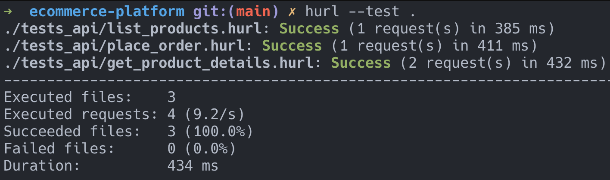

# Ecommerce Platform with Dynamic Pricing

## Overview
A lightweight e-commerce platform built with **Ruby on Rails**, using **MongoDB** as the database, **Sidekiq** for background job processing with **Redis**, and containerized using Docker. The platform supports dynamic product pricing, placing orders, and inventory updates, making it scalable and efficient for real-world applications.

### How Dynamic Pricing Works

The **Dynamic Pricing Engine** adjusts product prices based on three factors:

1. **Demand**:
    Tracks how frequently a product is purchased or added to orders.
    If demand increases, the price is raised to reflect its popularity.

2. **Inventory Levels**:
    Monitors the available stock of each product.
    Low stock increases the price to manage demand.
    High stock reduces the price to encourage sales.

3. **Competitor Prices**:
    Fetches competitor prices via the **Competitor Price API**.
    Adjusts the price to remain competitive:
    Matches or slightly undercuts competitor prices when possible.

#### Implementation Details

- A **background job** (run with Sidekiq) periodically recalculates prices for all products.
- The new price is calculated using weighted factors for demand, inventory, and competitor prices.
- Updates are saved in the `dynamic_price` field of each product.

## Features

1. **Product Management**
    - Import products from a CSV file.
    - View all products and details of a specific product, including dynamic pricing.

2. **Dynamic Pricing Engine**
    - Adjusts product prices based on:
        - **Demand**: Price increases with higher demand.
        - **Inventory Levels**: Price decreases when inventory is high, and increases when inventory is low.
        - **Competitor Prices**: Integrates with a simulated Competitor Price API.

3. **Order Management**
    - Place orders with validation for inventory availability.
    - Automatically updates inventory upon successful order placement.

4. **Background Jobs**
    - Periodic price adjustments using Sidekiq.
    - Integration with external Competitor Price API for price adjustments.
    - Start background job: `bundle exec sidekiq`

5. **API-Only Implementation**
    - No frontend; designed to be consumed via RESTful APIs.

6. **Containerized Deployment**
    - Uses Docker and Docker Compose for easy setup and deployment.

---
## API Endpoints

### Product Endpoints
1. **List Products**
    - `GET /products`
    - Returns all products.

2. **Get Product Details**
    - `GET /products/:id`
    - Returns details of a specific product.

### Order Endpoints
1. **Place an Order**
    - `POST /orders`
    - Parameters: `product_id`, `quantity`
    - Creates an order and updates inventory if sufficient stock is available.

---

## Requirements covered 

✅   Import products from CSV (name, category, qty, default price). The inventory CSV is provided here. \
✅   Show product details (including the dynamic price). \
✅   Place orders, where orders contain a list of products (ID, Qty, price per item). Successful order placements should decrease the inventory and fail if the inventory is low. \
✅   A Dynamic Pricing Engine. Implement a pricing engine that adjusts product prices based on: \
&nbsp;&nbsp;&nbsp;&nbsp;&nbsp;&nbsp;&nbsp;&nbsp;  Demand: Increase price if the product is frequently added to carts or purchased. \
&nbsp;&nbsp;&nbsp;&nbsp;&nbsp;&nbsp;&nbsp;&nbsp;  Inventory Levels: Decrease price if inventory levels are high, and increase price if inventory levels are low. \
&nbsp;&nbsp;&nbsp;&nbsp;&nbsp;&nbsp;&nbsp;&nbsp;  Competitor Prices: Adjust prices based on competitor prices fetched from a separate service API, located at: https://sinatra-pricing-api.fly.dev/docs \
&nbsp;&nbsp;&nbsp;&nbsp;&nbsp;&nbsp;&nbsp;&nbsp;  This Competitor Price API (https://sinatra-pricing-api.fly.dev/docs) is a simulation of a realistic third party provider. \

✅    Write a clear and concise README documentation that includes: \
&nbsp;&nbsp;&nbsp;&nbsp;&nbsp;&nbsp;&nbsp;&nbsp;  An overview of the E-commerce platform, and how the dynamic pricing works. \
&nbsp;&nbsp;&nbsp;&nbsp;&nbsp;&nbsp;&nbsp;&nbsp;  All API endpoints, request/response formats, and examples of usage. \
&nbsp;&nbsp;&nbsp;&nbsp;&nbsp;&nbsp;&nbsp;&nbsp;  A simple guide on how to set up and run the application locally. \

---
Technical Requirements: \
Backend: \
✅   Use Ruby on Rails for the backend. \
✅   Use MongoDB for the database. \
✅   Implement background jobs (e.g., with Sidekiq) for updating prices periodically from the Competitor Price API, based on the pricing engine rules.

Testing: \
✅   Write unit and integration tests for key functionalities (RSpec or Minitest).

Frontend: \
✅   For the sake of simplicity, no UI is required, just the API.


## How to build & run the service
```shell
$ docker compose up --build
```
Import data from CSV manually
```shell
$ rails c

ecommerce-platform(dev)> CsvImporter.import('tmp/inventory.csv')
```

## How to test
Unit Tests
```shell
$ bundle exec rspec
```
API Tests
```shell
# need to install hurl first
# under root folder: ecommerce-platform
$ hurl --test . 
```


## Prerequisites & libs

- **Docker** (v20.10+)
- **Docker Compose** (v2.0+)
- **Ruby** (v3+) - for local development.
- **MongoDB** (v5.0) - used as the database.
- **Redis** (v7.0) - for background job processing.
